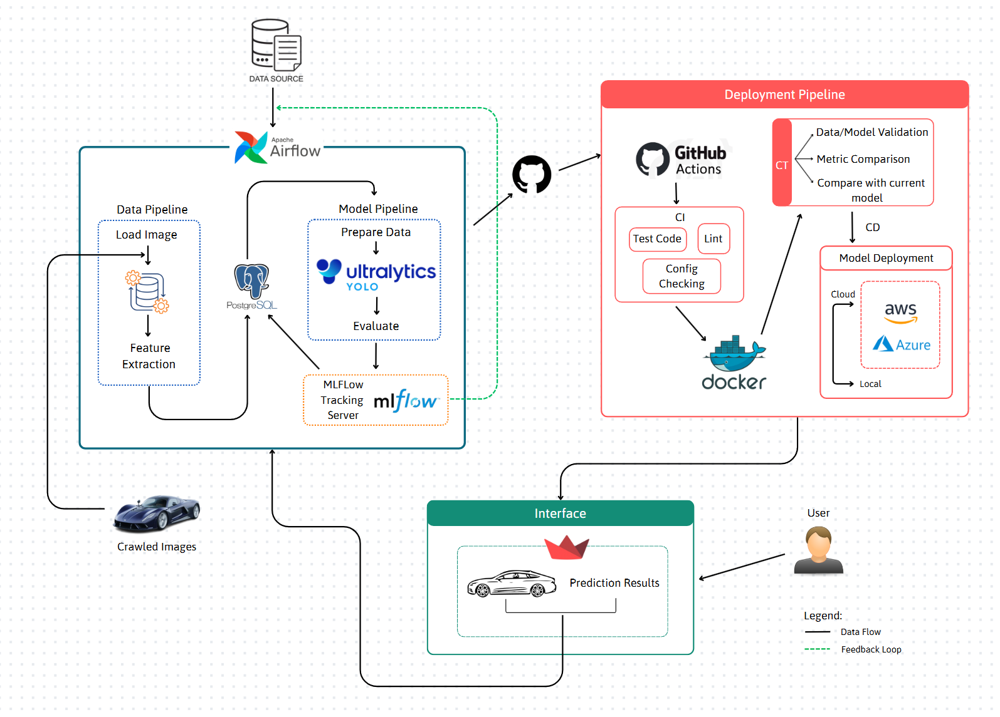

# Vehicle Detection Pipeline

A complete end-to-end object detection pipeline for detecting cars, trucks, buses, and taxis using YOLOv11. The system integrates data ingestion, model training, experiment tracking, and a Streamlit-based visual interface.
The overall architecture can be seen as follows. 


## 🚀 Features
- **Airflow**-driven training pipeline (fetch, label, split, train)
- **YOLOv11** object detection model
- **MLflow** model tracking and metrics logging
- **Streamlit** frontend to run inference and give feedback
- **PostgreSQL** image + label storage and feedback loggin

## 📌 Tech Stack
- Python  
- YOLOv11 (via Ultralytics)  
- Apache Airflow  
- MLflow  
- Streamlit  
- PostgreSQL  
- Docker + Docker Compose  
- GitHub Actions

## 📁 Project Structure
```plaintext
├── .gitignore
├── README.md
├── requirements.txt                 # Python dependencies
├── .github/
│   └── workflows/
│       ├── cicd.yaml                # CI/CD pipeline configuration               
│       └── ui.yaml                  # UI deployment workflow
├── data_pipeline/
│   ├── crawl_test/                  # Scripts for crawling test data
│   │   ├── README.md
│   │   ├── download_images.py       # Downloads images from sources
│   │   ├── extract_video_frames.py  # Extracts frames from videos
│   │   └── process.sh
│   ├── flow/
│   │   ├── .env
│   │   ├── Dockerfile
│   │   ├── README.md
│   │   ├── car_dag.py               # DAG for car data processing
│   │   ├── crawl_dag.py             # DAG for crawling pipeline
│   │   ├── docker-compose.prod.yml
│   │   ├── docker-compose.yml
│   │   ├── model_dag.py             # DAG for ML model pipeline
│   │   └── run.sh                   # Script to run the pipeline
│   └── traindata/                   # Scripts for generating training data
│       ├── README.md
│       └── takealldata.py
├── serving_pipeline/                # Model serving and UI
│   ├── .gitignore
│   ├── Dockerfile
│   ├── README.md
│   ├── __init__.py
│   ├── car_labels.csv
│   ├── config.py
│   ├── db.py
│   ├── downloader.py
│   ├── requirements.txt
│   ├── ui.py                        # Frontend UI logic
│   └── utils.py
└── tracking_pipeline/
    ├── README.md
    └── tracking.ipynb               # Sample Jupyter Notebook for tracking
```

## 🛠️ Setup Instructions
### 1. Clone the Repository and Install Necessary Dependencies 
```bash
git clone https://github.com/meredithoopis/mlops.git
cd mlops
``` 
After that, run: 
```bash
pip install -r requirements.txt 
```
### 2. Downloading the data 
Navigate to the traindata folder to download the necessary data. 
```
cd data_pipeline/traindata
python python takealldata.py
```
### 3. Setting up variables and API keys 
Navigate to the data_pipeline folder, and fill in the .env file: 
```bash 
cd .. 
cd flow
```
Fill in the information in the .env file, make sure you already have PostgreSQL configured with a hostname and a database. 
```env 
API_KEY=Your Serapi as in the data_pipeline/crawl_test folder 
AIRFLOW_UID=1000
DB_HOST=Your host 
DB_NAME=Your database name
DB_USER=Your database username
DB_PASSWORD=Your database password
DB_PORT=5432 
POSTGRES_USER=Your PostgreSQL username 
POSTGRES_PASSWORD=Your PostgreSQL password
POSTGRES_DB=Your PostgreSQL database 
``` 
### 4. Setting up Airflow and run 
```bash
chmod +x run.sh
./run.sh  
```
After that, navigate to `localhost:8000` to see the Airflow interface, use your defined Airflow username and password to login. Upon successful login, you will have 3 DAGs to run. First, run the `car_pipeline_batch` DAG to put data into the database for training, then run the `image_video_processing` DAG to crawl data for testing, and finally run the `yolo_train_pipeline` to auto train the model and log to MLflow. 
In the same folder, run the following: 
```bash
mlflow ui --backend-store-uri ./mlruns --port 5000 
```
and go to `localhost:5000` to see the MLflow interface. 

### 5. Access the app interface 
Navigate to the serving_pipeline to see the interface. 
```bash
streamlit run ui.py  
```

## ✅ TODOs for the near future 

- [ ] Intergrate cloud services for deployment tasks.  
- [ ] Improve the user interface.  
- [ ] Enable lighter conterization.  


